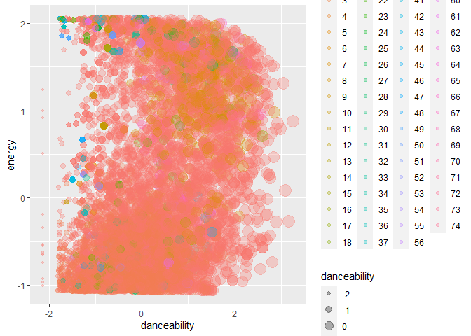
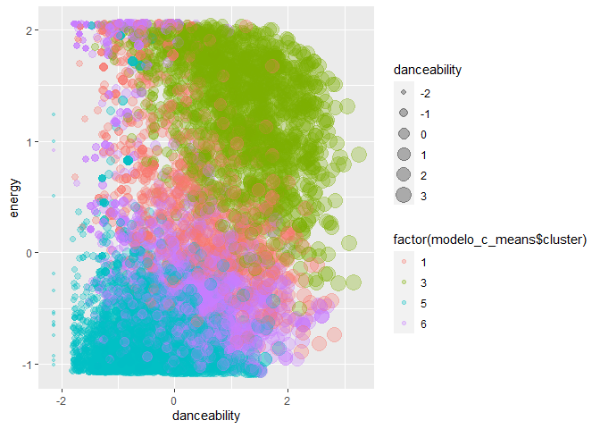
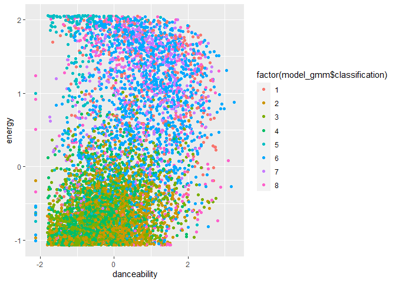
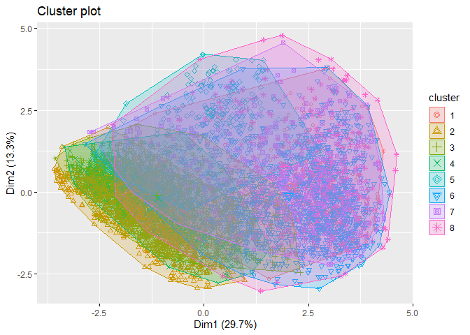
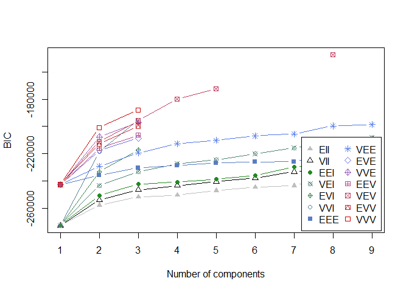

Untitled
================

## Librerias

``` r
library(psych)
library(dplyr)
```

    ## 
    ## Attaching package: 'dplyr'

    ## The following objects are masked from 'package:stats':
    ## 
    ##     filter, lag

    ## The following objects are masked from 'package:base':
    ## 
    ##     intersect, setdiff, setequal, union

``` r
library(stringr)
library(datasets.load)
library(tidyverse)
```

    ## -- Attaching packages --------------------------------------- tidyverse 1.3.1 --

    ## v ggplot2 3.3.3     v readr   1.4.0
    ## v tibble  3.1.0     v purrr   0.3.4
    ## v tidyr   1.1.3     v forcats 0.5.1

    ## -- Conflicts ------------------------------------------ tidyverse_conflicts() --
    ## x ggplot2::%+%()   masks psych::%+%()
    ## x ggplot2::alpha() masks psych::alpha()
    ## x dplyr::filter()  masks stats::filter()
    ## x dplyr::lag()     masks stats::lag()

``` r
library(tm)
```

    ## Loading required package: NLP

    ## 
    ## Attaching package: 'NLP'

    ## The following object is masked from 'package:ggplot2':
    ## 
    ##     annotate

``` r
library(tidytext)
library(quanteda)
```

    ## Package version: 3.0.0
    ## Unicode version: 10.0
    ## ICU version: 61.1

    ## Parallel computing: 8 of 8 threads used.

    ## See https://quanteda.io for tutorials and examples.

    ## 
    ## Attaching package: 'quanteda'

    ## The following object is masked from 'package:tm':
    ## 
    ##     stopwords

    ## The following objects are masked from 'package:NLP':
    ## 
    ##     meta, meta<-

``` r
library(quanteda.textstats)
library(ggplot2)
library(wordcloud)
```

    ## Loading required package: RColorBrewer

``` r
library(lubridate)
```

    ## 
    ## Attaching package: 'lubridate'

    ## The following objects are masked from 'package:base':
    ## 
    ##     date, intersect, setdiff, union

``` r
library(readxl)
library(chron)
```

    ## 
    ## Attaching package: 'chron'

    ## The following objects are masked from 'package:lubridate':
    ## 
    ##     days, hours, minutes, seconds, years

``` r
library(factoextra)
```

    ## Welcome! Want to learn more? See two factoextra-related books at https://goo.gl/ve3WBa

``` r
library(flexclust)
```

    ## Loading required package: grid

    ## Loading required package: lattice

    ## Loading required package: modeltools

    ## Loading required package: stats4

``` r
library(cluster)
library(ggdendro)
library(factoextra)
library(knitr)
library(mclust)
```

    ## Package 'mclust' version 5.4.7
    ## Type 'citation("mclust")' for citing this R package in publications.

    ## 
    ## Attaching package: 'mclust'

    ## The following object is masked from 'package:purrr':
    ## 
    ##     map

    ## The following object is masked from 'package:psych':
    ## 
    ##     sim

``` r
library(dbscan)
library(e1071)
```

    ## 
    ## Attaching package: 'e1071'

    ## The following object is masked from 'package:flexclust':
    ## 
    ##     bclust

\#\#cargamos los datos

``` r
setwd("C:/Users/Dieca/OneDrive/Escritorio/actividad 8")
beats2 <- read.csv("beats2.csv", sep = ",")
```

## Comprobar Datos NA y Cambiar Tipo Data

``` r
beats2 %>% 
  summarise_all(funs(sum(is.na(.))))
```

    ## Warning: `funs()` was deprecated in dplyr 0.8.0.
    ## Please use a list of either functions or lambdas: 
    ## 
    ##   # Simple named list: 
    ##   list(mean = mean, median = median)
    ## 
    ##   # Auto named with `tibble::lst()`: 
    ##   tibble::lst(mean, median)
    ## 
    ##   # Using lambdas
    ##   list(~ mean(., trim = .2), ~ median(., na.rm = TRUE))

    ##   X artist_name artist_id album_id album_type album_release_date
    ## 1 0           0         0        0          0                  0
    ##   album_release_year album_release_date_precision danceability energy key
    ## 1                  9                            0            0      0   0
    ##   loudness mode speechiness acousticness instrumentalness liveness valence
    ## 1        0    0           0            0                0        0       0
    ##   tempo track_id analysis_url time_signature disc_number duration_ms explicit
    ## 1     0        0            0              0           0           0        0
    ##   track_href is_local track_name track_preview_url track_number type track_uri
    ## 1          0        0          0              3165            0    0         0
    ##   external_urls.spotify album_name key_name mode_name key_mode
    ## 1                     0          0        0         0        0

``` r
str(beats2)
```

    ## 'data.frame':    8000 obs. of  37 variables:
    ##  $ X                           : int  1 2 3 4 5 6 7 8 9 10 ...
    ##  $ artist_name                 : chr  "Mother Nature Sound FX" "Café Tacvba" "Mother Nature Sound FX" "Ludwig van Beethoven" ...
    ##  $ artist_id                   : chr  "4lrOh2SR7H3guHky2lAYOk" "09xj0S68Y1OU1vHMCZAIvz" "4lrOh2SR7H3guHky2lAYOk" "2wOqMjp9TyABvtHdOSOTUS" ...
    ##  $ album_id                    : chr  "19w8ZLSzmTeIbjlkcuCuve" "2qbDaaW7eJ42FByw7pQkZQ" "3CzuJmTTV9icsV0HJC9D2F" "0sexwnbqPFl82621OB0HWT" ...
    ##  $ album_type                  : chr  "album" "album" "album" "album" ...
    ##  $ album_release_date          : chr  "2020-12-01" "2012-01-01" "2020-07-07" "2017-10-13" ...
    ##  $ album_release_year          : int  2020 2012 2020 2017 2000 2020 2020 2020 2007 1997 ...
    ##  $ album_release_date_precision: chr  "day" "day" "day" "day" ...
    ##  $ danceability                : num  0.106 0.431 0.183 0.306 0.332 0.332 0.305 0.364 0.582 0.394 ...
    ##  $ energy                      : num  0.998 0.911 0.348 0.0862 0.0659 0.206 0.0477 0.0362 0.801 0.675 ...
    ##  $ key                         : int  9 11 5 0 5 11 3 10 4 7 ...
    ##  $ loudness                    : num  -23.79 -6.62 -21.87 -22.21 -22.83 ...
    ##  $ mode                        : int  1 1 1 0 0 0 1 1 1 1 ...
    ##  $ speechiness                 : num  0.0604 0.0304 0.0676 0.0399 0.031 0.041 0.0387 0.056 0.0354 0.0495 ...
    ##  $ acousticness                : num  0.758 0.000008 0.00566 0.965 0.991 0.992 0.989 0.993 0.165 0.197 ...
    ##  $ instrumentalness            : num  9.63e-01 8.22e-02 3.94e-04 8.60e-01 8.78e-01 1.01e-06 8.39e-01 9.11e-01 0.00 1.67e-05 ...
    ##  $ liveness                    : num  0.69 0.293 0.391 0.121 0.133 0.192 0.0823 0.0828 0.111 0.347 ...
    ##  $ valence                     : num  0.00001 0.725 0.103 0.0775 0.116 0.259 0.178 0.0952 0.522 0.432 ...
    ##  $ tempo                       : num  172 148 116.4 139.1 74.9 ...
    ##  $ track_id                    : chr  "4BT4CvFW2WppTDpoOs0R66" "5L9NeExCJmqttkqFywSjcV" "01cahygYAqmiBIxLQP8J25" "6hMFuLwcJjK8j2vLDbM4sj" ...
    ##  $ analysis_url                : chr  "https://api.spotify.com/v1/audio-analysis/4BT4CvFW2WppTDpoOs0R66" "https://api.spotify.com/v1/audio-analysis/5L9NeExCJmqttkqFywSjcV" "https://api.spotify.com/v1/audio-analysis/01cahygYAqmiBIxLQP8J25" "https://api.spotify.com/v1/audio-analysis/6hMFuLwcJjK8j2vLDbM4sj" ...
    ##  $ time_signature              : int  5 4 5 4 3 3 4 4 4 4 ...
    ##  $ disc_number                 : int  1 1 1 1 1 1 1 1 1 4 ...
    ##  $ duration_ms                 : int  153417 241573 168000 1009077 169706 132546 420666 740880 266546 925066 ...
    ##  $ explicit                    : logi  FALSE FALSE FALSE FALSE FALSE FALSE ...
    ##  $ track_href                  : chr  "https://api.spotify.com/v1/tracks/4BT4CvFW2WppTDpoOs0R66" "https://api.spotify.com/v1/tracks/5L9NeExCJmqttkqFywSjcV" "https://api.spotify.com/v1/tracks/01cahygYAqmiBIxLQP8J25" "https://api.spotify.com/v1/tracks/6hMFuLwcJjK8j2vLDbM4sj" ...
    ##  $ is_local                    : logi  FALSE FALSE FALSE FALSE FALSE FALSE ...
    ##  $ track_name                  : chr  "One Earth" "Andamios" "Rainy Meanderings" "Piano Concerto No. 3 in C Minor, Op. 37: I. Allegro con brio" ...
    ##  $ track_preview_url           : chr  "https://p.scdn.co/mp3-preview/ce8c42820164aa011a9698479d15a9a819a1fb03?cid=ac26d97eca664234ab133e5208ea5737" NA "https://p.scdn.co/mp3-preview/2f2d09ecbf7e14379d8274acfa6a0ffedece86fc?cid=ac26d97eca664234ab133e5208ea5737" "https://p.scdn.co/mp3-preview/1982e1f8114eb12380020fcb723bc53f438633cb?cid=ac26d97eca664234ab133e5208ea5737" ...
    ##  $ track_number                : int  61 2 12 4 9 189 30 1 9 3 ...
    ##  $ type                        : chr  "track" "track" "track" "track" ...
    ##  $ track_uri                   : chr  "spotify:track:4BT4CvFW2WppTDpoOs0R66" "spotify:track:5L9NeExCJmqttkqFywSjcV" "spotify:track:01cahygYAqmiBIxLQP8J25" "spotify:track:6hMFuLwcJjK8j2vLDbM4sj" ...
    ##  $ external_urls.spotify       : chr  "https://open.spotify.com/track/4BT4CvFW2WppTDpoOs0R66" "https://open.spotify.com/track/5L9NeExCJmqttkqFywSjcV" "https://open.spotify.com/track/01cahygYAqmiBIxLQP8J25" "https://open.spotify.com/track/6hMFuLwcJjK8j2vLDbM4sj" ...
    ##  $ album_name                  : chr  "! ! ! ! ! Balcony ! ! ! ! !" "El Objeto Antes Llamado Disco" "40 Relaxing Rain Sounds for Serenity and Sleep" "Beethoven: Triple Concerto & Piano Concerto No. 3" ...
    ##  $ key_name                    : chr  "A" "B" "F" "C" ...
    ##  $ mode_name                   : chr  "major" "major" "major" "minor" ...
    ##  $ key_mode                    : chr  "A major" "B major" "F major" "C minor" ...

-   Segundo filtrar y remover datos duplicados

``` r
beats2 <- beats2[!duplicated(beats2$track_id),]
```

-   Tercero, Seguimos con la limpieza Separamos las variables numéricas
    y char dos dataframes distintos

``` r
beats2_char <- c("artist_name", "artist_id", "album_id", "album_type", "album_release_date", "album_release_date_precision", "track_id", "analysis_url", "track_href", "track_name", "track_preview_url", "type", "track_uri", "external_urls.spotify", "album_name", "key_name", "mode_name", "key_mode")
beats2_num <- c("danceability", "energy", "key", "loudness", "mode", "speechiness", "acousticness", "instrumentalness", "liveness", "valence", "tempo", "duration_ms")
beats2 <- beats2 %>% 
  filter(!(is.na(key)|is.na(danceability)))
summary(beats2)
```

    ##        X        artist_name         artist_id           album_id        
    ##  Min.   :   1   Length:7999        Length:7999        Length:7999       
    ##  1st Qu.:2000   Class :character   Class :character   Class :character  
    ##  Median :4001   Mode  :character   Mode  :character   Mode  :character  
    ##  Mean   :4001                                                           
    ##  3rd Qu.:6000                                                           
    ##  Max.   :8000                                                           
    ##                                                                         
    ##   album_type        album_release_date album_release_year
    ##  Length:7999        Length:7999        Min.   :1919      
    ##  Class :character   Class :character   1st Qu.:2010      
    ##  Mode  :character   Mode  :character   Median :2018      
    ##                                        Mean   :2013      
    ##                                        3rd Qu.:2020      
    ##                                        Max.   :2021      
    ##                                        NA's   :9         
    ##  album_release_date_precision  danceability        energy       
    ##  Length:7999                  Min.   :0.0000   Min.   :0.00024  
    ##  Class :character             1st Qu.:0.2500   1st Qu.:0.07585  
    ##  Mode  :character             Median :0.3680   Median :0.21000  
    ##                               Mean   :0.3898   Mean   :0.34257  
    ##                               3rd Qu.:0.5120   3rd Qu.:0.59800  
    ##                               Max.   :0.9840   Max.   :1.00000  
    ##                                                                 
    ##       key            loudness            mode         speechiness     
    ##  Min.   : 0.000   Min.   :-45.901   Min.   :0.0000   Min.   :0.00000  
    ##  1st Qu.: 2.000   1st Qu.:-24.616   1st Qu.:0.0000   1st Qu.:0.03790  
    ##  Median : 5.000   Median :-19.450   Median :1.0000   Median :0.04420  
    ##  Mean   : 5.069   Mean   :-18.700   Mean   :0.6891   Mean   :0.06801  
    ##  3rd Qu.: 8.000   3rd Qu.:-11.477   3rd Qu.:1.0000   3rd Qu.:0.05890  
    ##  Max.   :11.000   Max.   : -0.874   Max.   :1.0000   Max.   :0.95900  
    ##                                                                       
    ##   acousticness    instrumentalness     liveness         valence       
    ##  Min.   :0.0000   Min.   :0.00000   Min.   :0.0000   Min.   :0.00000  
    ##  1st Qu.:0.3545   1st Qu.:0.00174   1st Qu.:0.0969   1st Qu.:0.08985  
    ##  Median :0.9240   Median :0.70300   Median :0.1230   Median :0.26800  
    ##  Mean   :0.6942   Mean   :0.50192   Mean   :0.2222   Mean   :0.33847  
    ##  3rd Qu.:0.9860   3rd Qu.:0.90000   3rd Qu.:0.2600   3rd Qu.:0.54200  
    ##  Max.   :0.9960   Max.   :0.99800   Max.   :0.9960   Max.   :0.99200  
    ##                                                                       
    ##      tempo          track_id         analysis_url       time_signature 
    ##  Min.   :  0.00   Length:7999        Length:7999        Min.   :0.000  
    ##  1st Qu.: 82.23   Class :character   Class :character   1st Qu.:4.000  
    ##  Median :105.77   Mode  :character   Mode  :character   Median :4.000  
    ##  Mean   :109.13                                         Mean   :3.736  
    ##  3rd Qu.:131.63                                         3rd Qu.:4.000  
    ##  Max.   :210.23                                         Max.   :5.000  
    ##                                                                        
    ##   disc_number      duration_ms       explicit        track_href       
    ##  Min.   : 1.000   Min.   :   7619   Mode :logical   Length:7999       
    ##  1st Qu.: 1.000   1st Qu.: 126440   FALSE:7901      Class :character  
    ##  Median : 1.000   Median : 195306   TRUE :98        Mode  :character  
    ##  Mean   : 1.205   Mean   : 232084                                     
    ##  3rd Qu.: 1.000   3rd Qu.: 270493                                     
    ##  Max.   :25.000   Max.   :4432171                                     
    ##                                                                       
    ##   is_local        track_name        track_preview_url   track_number   
    ##  Mode :logical   Length:7999        Length:7999        Min.   :  1.00  
    ##  FALSE:7999      Class :character   Class :character   1st Qu.:  5.00  
    ##                  Mode  :character   Mode  :character   Median : 11.00  
    ##                                                        Mean   : 44.51  
    ##                                                        3rd Qu.: 30.00  
    ##                                                        Max.   :529.00  
    ##                                                                        
    ##      type            track_uri         external_urls.spotify  album_name       
    ##  Length:7999        Length:7999        Length:7999           Length:7999       
    ##  Class :character   Class :character   Class :character      Class :character  
    ##  Mode  :character   Mode  :character   Mode  :character      Mode  :character  
    ##                                                                                
    ##                                                                                
    ##                                                                                
    ##                                                                                
    ##    key_name          mode_name           key_mode        
    ##  Length:7999        Length:7999        Length:7999       
    ##  Class :character   Class :character   Class :character  
    ##  Mode  :character   Mode  :character   Mode  :character  
    ##                                                          
    ##                                                          
    ##                                                          
    ## 

``` r
str(beats2)
```

    ## 'data.frame':    7999 obs. of  37 variables:
    ##  $ X                           : int  1 2 3 4 5 6 7 8 9 10 ...
    ##  $ artist_name                 : chr  "Mother Nature Sound FX" "Café Tacvba" "Mother Nature Sound FX" "Ludwig van Beethoven" ...
    ##  $ artist_id                   : chr  "4lrOh2SR7H3guHky2lAYOk" "09xj0S68Y1OU1vHMCZAIvz" "4lrOh2SR7H3guHky2lAYOk" "2wOqMjp9TyABvtHdOSOTUS" ...
    ##  $ album_id                    : chr  "19w8ZLSzmTeIbjlkcuCuve" "2qbDaaW7eJ42FByw7pQkZQ" "3CzuJmTTV9icsV0HJC9D2F" "0sexwnbqPFl82621OB0HWT" ...
    ##  $ album_type                  : chr  "album" "album" "album" "album" ...
    ##  $ album_release_date          : chr  "2020-12-01" "2012-01-01" "2020-07-07" "2017-10-13" ...
    ##  $ album_release_year          : int  2020 2012 2020 2017 2000 2020 2020 2020 2007 1997 ...
    ##  $ album_release_date_precision: chr  "day" "day" "day" "day" ...
    ##  $ danceability                : num  0.106 0.431 0.183 0.306 0.332 0.332 0.305 0.364 0.582 0.394 ...
    ##  $ energy                      : num  0.998 0.911 0.348 0.0862 0.0659 0.206 0.0477 0.0362 0.801 0.675 ...
    ##  $ key                         : int  9 11 5 0 5 11 3 10 4 7 ...
    ##  $ loudness                    : num  -23.79 -6.62 -21.87 -22.21 -22.83 ...
    ##  $ mode                        : int  1 1 1 0 0 0 1 1 1 1 ...
    ##  $ speechiness                 : num  0.0604 0.0304 0.0676 0.0399 0.031 0.041 0.0387 0.056 0.0354 0.0495 ...
    ##  $ acousticness                : num  0.758 0.000008 0.00566 0.965 0.991 0.992 0.989 0.993 0.165 0.197 ...
    ##  $ instrumentalness            : num  9.63e-01 8.22e-02 3.94e-04 8.60e-01 8.78e-01 1.01e-06 8.39e-01 9.11e-01 0.00 1.67e-05 ...
    ##  $ liveness                    : num  0.69 0.293 0.391 0.121 0.133 0.192 0.0823 0.0828 0.111 0.347 ...
    ##  $ valence                     : num  0.00001 0.725 0.103 0.0775 0.116 0.259 0.178 0.0952 0.522 0.432 ...
    ##  $ tempo                       : num  172 148 116.4 139.1 74.9 ...
    ##  $ track_id                    : chr  "4BT4CvFW2WppTDpoOs0R66" "5L9NeExCJmqttkqFywSjcV" "01cahygYAqmiBIxLQP8J25" "6hMFuLwcJjK8j2vLDbM4sj" ...
    ##  $ analysis_url                : chr  "https://api.spotify.com/v1/audio-analysis/4BT4CvFW2WppTDpoOs0R66" "https://api.spotify.com/v1/audio-analysis/5L9NeExCJmqttkqFywSjcV" "https://api.spotify.com/v1/audio-analysis/01cahygYAqmiBIxLQP8J25" "https://api.spotify.com/v1/audio-analysis/6hMFuLwcJjK8j2vLDbM4sj" ...
    ##  $ time_signature              : int  5 4 5 4 3 3 4 4 4 4 ...
    ##  $ disc_number                 : int  1 1 1 1 1 1 1 1 1 4 ...
    ##  $ duration_ms                 : int  153417 241573 168000 1009077 169706 132546 420666 740880 266546 925066 ...
    ##  $ explicit                    : logi  FALSE FALSE FALSE FALSE FALSE FALSE ...
    ##  $ track_href                  : chr  "https://api.spotify.com/v1/tracks/4BT4CvFW2WppTDpoOs0R66" "https://api.spotify.com/v1/tracks/5L9NeExCJmqttkqFywSjcV" "https://api.spotify.com/v1/tracks/01cahygYAqmiBIxLQP8J25" "https://api.spotify.com/v1/tracks/6hMFuLwcJjK8j2vLDbM4sj" ...
    ##  $ is_local                    : logi  FALSE FALSE FALSE FALSE FALSE FALSE ...
    ##  $ track_name                  : chr  "One Earth" "Andamios" "Rainy Meanderings" "Piano Concerto No. 3 in C Minor, Op. 37: I. Allegro con brio" ...
    ##  $ track_preview_url           : chr  "https://p.scdn.co/mp3-preview/ce8c42820164aa011a9698479d15a9a819a1fb03?cid=ac26d97eca664234ab133e5208ea5737" NA "https://p.scdn.co/mp3-preview/2f2d09ecbf7e14379d8274acfa6a0ffedece86fc?cid=ac26d97eca664234ab133e5208ea5737" "https://p.scdn.co/mp3-preview/1982e1f8114eb12380020fcb723bc53f438633cb?cid=ac26d97eca664234ab133e5208ea5737" ...
    ##  $ track_number                : int  61 2 12 4 9 189 30 1 9 3 ...
    ##  $ type                        : chr  "track" "track" "track" "track" ...
    ##  $ track_uri                   : chr  "spotify:track:4BT4CvFW2WppTDpoOs0R66" "spotify:track:5L9NeExCJmqttkqFywSjcV" "spotify:track:01cahygYAqmiBIxLQP8J25" "spotify:track:6hMFuLwcJjK8j2vLDbM4sj" ...
    ##  $ external_urls.spotify       : chr  "https://open.spotify.com/track/4BT4CvFW2WppTDpoOs0R66" "https://open.spotify.com/track/5L9NeExCJmqttkqFywSjcV" "https://open.spotify.com/track/01cahygYAqmiBIxLQP8J25" "https://open.spotify.com/track/6hMFuLwcJjK8j2vLDbM4sj" ...
    ##  $ album_name                  : chr  "! ! ! ! ! Balcony ! ! ! ! !" "El Objeto Antes Llamado Disco" "40 Relaxing Rain Sounds for Serenity and Sleep" "Beethoven: Triple Concerto & Piano Concerto No. 3" ...
    ##  $ key_name                    : chr  "A" "B" "F" "C" ...
    ##  $ mode_name                   : chr  "major" "major" "major" "minor" ...
    ##  $ key_mode                    : chr  "A major" "B major" "F major" "C minor" ...

## Separo Datos

``` r
beats2num <- beats2 %>% 
  select(beats2_num)
```

    ## Note: Using an external vector in selections is ambiguous.
    ## i Use `all_of(beats2_num)` instead of `beats2_num` to silence this message.
    ## i See <https://tidyselect.r-lib.org/reference/faq-external-vector.html>.
    ## This message is displayed once per session.

``` r
beats2char <- beats2 %>% 
  select(beats2_char)
```

    ## Note: Using an external vector in selections is ambiguous.
    ## i Use `all_of(beats2_char)` instead of `beats2_char` to silence this message.
    ## i See <https://tidyselect.r-lib.org/reference/faq-external-vector.html>.
    ## This message is displayed once per session.

## Escalar Datos

``` r
beats2_sca <- sapply(beats2num, scale) %>% as_tibble()
beats2_sca %>% summary()
```

    ##   danceability         energy             key              loudness       
    ##  Min.   :-2.1356   Min.   :-1.0698   Min.   :-1.44562   Min.   :-3.10792  
    ##  1st Qu.:-0.7658   1st Qu.:-0.8335   1st Qu.:-0.87523   1st Qu.:-0.67595  
    ##  Median :-0.1193   Median :-0.4143   Median :-0.01965   Median :-0.08569  
    ##  Mean   : 0.0000   Mean   : 0.0000   Mean   : 0.00000   Mean   : 0.00000  
    ##  3rd Qu.: 0.6697   3rd Qu.: 0.7982   3rd Qu.: 0.83594   3rd Qu.: 0.82523  
    ##  Max.   : 3.2559   Max.   : 2.0545   Max.   : 1.69152   Max.   : 2.03676  
    ##       mode          speechiness       acousticness     instrumentalness 
    ##  Min.   :-1.4886   Min.   :-0.7573   Min.   :-1.8604   Min.   :-1.2101  
    ##  1st Qu.:-1.4886   1st Qu.:-0.3353   1st Qu.:-0.9104   1st Qu.:-1.2059  
    ##  Median : 0.6717   Median :-0.2651   Median : 0.6158   Median : 0.4848  
    ##  Mean   : 0.0000   Mean   : 0.0000   Mean   : 0.0000   Mean   : 0.0000  
    ##  3rd Qu.: 0.6717   3rd Qu.:-0.1014   3rd Qu.: 0.7819   3rd Qu.: 0.9597  
    ##  Max.   : 0.6717   Max.   : 9.9205   Max.   : 0.8087   Max.   : 1.1960  
    ##     liveness          valence            tempo          duration_ms     
    ##  Min.   :-1.0161   Min.   :-1.2241   Min.   :-3.4363   Min.   :-1.1816  
    ##  1st Qu.:-0.5730   1st Qu.:-0.8992   1st Qu.:-0.8469   1st Qu.:-0.5561  
    ##  Median :-0.4537   Median :-0.2549   Median :-0.1059   Median :-0.1936  
    ##  Mean   : 0.0000   Mean   : 0.0000   Mean   : 0.0000   Mean   : 0.0000  
    ##  3rd Qu.: 0.1728   3rd Qu.: 0.7361   3rd Qu.: 0.7084   3rd Qu.: 0.2022  
    ##  Max.   : 3.5380   Max.   : 2.3636   Max.   : 3.1833   Max.   :22.1096

\#\#DBSCAN primer metodo cluster por densidad

``` r
set.seed(369)
model = dbscan(beats2_sca, eps = 1, minPts = 6)

model
```

    ## DBSCAN clustering for 7999 objects.
    ## Parameters: eps = 1, minPts = 6
    ## The clustering contains 74 cluster(s) and 4013 noise points.
    ## 
    ##    0    1    2    3    4    5    6    7    8    9   10   11   12   13   14   15 
    ## 4013  620 2400    8   17   17    8  337    6    6   10   21   12   10    7    7 
    ##   16   17   18   19   20   21   22   23   24   25   26   27   28   29   30   31 
    ##   12   17   52   21   12    6    6   14    6    6    9   15    8    5    7    6 
    ##   32   33   34   35   36   37   38   39   40   41   42   43   44   45   46   47 
    ##    7    7    8    4    9    8    6    8   11    9    6    5    6    7    6    7 
    ##   48   49   50   51   52   53   54   55   56   57   58   59   60   61   62   63 
    ##    6    9    6    6    7    5   10    6    9    6    6   15    6   10    6    5 
    ##   64   65   66   67   68   69   70   71   72   73   74 
    ##    2    4    6   13    5    6    4    8    6    7    5 
    ## 
    ## Available fields: cluster, eps, minPts

``` r
# El modelo genera 74 cluster
```

## Plot

``` r
ggplot(beats2_sca, aes(danceability, energy, color = factor(model$cluster), size =danceability )) + 
  geom_point(alpha = 0.3)
```

<!-- -->

## C means

``` r
set.seed(369)

modelo_c_means <- cmeans(beats2_sca,  7, m=2) 

modelo_c_means$membership %>% head()
```

    ##               1          2          3          4         5         6          7
    ## [1,] 0.12683533 0.14933677 0.12645131 0.14934651 0.1493365 0.1493569 0.14933673
    ## [2,] 0.26705549 0.09286392 0.26854008 0.09289191 0.0928630 0.0929218 0.09286381
    ## [3,] 0.14553789 0.14189850 0.14488516 0.14192636 0.1418976 0.1419561 0.14189839
    ## [4,] 0.10910499 0.15642038 0.10881867 0.15641195 0.1564207 0.1564029 0.15642041
    ## [5,] 0.05130368 0.17957857 0.05102010 0.17950708 0.1795809 0.1794308 0.17957885
    ## [6,] 0.09574424 0.16178672 0.09527091 0.16180364 0.1617862 0.1618217 0.16178666

``` r
#El algoritmo cmeans asigna como cluster al que tenga mayor probabilidad
```

## PLOT

``` r
ggplot(beats2_sca, aes(danceability,energy , color = factor(modelo_c_means$cluster), size = danceability)) + 
  geom_point(alpha = 0.3)
```

<!-- -->

\#\#FCP

``` r
matriz <- modelo_c_means$membership%*%t(modelo_c_means$membership) # producto matricial

(FPC <- sum(matriz*diag(nrow(matriz)))/nrow(matriz))
```

    ## [1] 0.1596691

``` r
#El valor del FPC es bajo, lo que significa que los grupos tienen alta variabilidad, y se puede confirmar en la figura ya que no se ven grupos definidos.
```

\#\#GMM

``` r
library(mclust)

set.seed(369)

model_gmm = Mclust(beats2_sca)

model_gmm 
```

    ## 'Mclust' model object: (VEV,8) 
    ## 
    ## Available components: 
    ##  [1] "call"           "data"           "modelName"      "n"             
    ##  [5] "d"              "G"              "BIC"            "loglik"        
    ##  [9] "df"             "bic"            "icl"            "hypvol"        
    ## [13] "parameters"     "z"              "classification" "uncertainty"

``` r
summary(model_gmm, parameters = TRUE)
```

    ## ---------------------------------------------------- 
    ## Gaussian finite mixture model fitted by EM algorithm 
    ## ---------------------------------------------------- 
    ## 
    ## Mclust VEV (ellipsoidal, equal shape) model with 8 components: 
    ## 
    ##  log-likelihood    n  df       BIC     ICL
    ##       -70805.55 7999 650 -147452.7 -147961
    ## 
    ## Clustering table:
    ##    1    2    3    4    5    6    7    8 
    ##  351 1742 1369 1479  553 1540  566  399 
    ## 
    ## Mixing probabilities:
    ##          1          2          3          4          5          6          7 
    ## 0.04377429 0.21501055 0.17108057 0.18612905 0.06925343 0.19340377 0.07112332 
    ##          8 
    ## 0.05022501 
    ## 
    ## Means:
    ##                         [,1]        [,2]        [,3]         [,4]        [,5]
    ## danceability      0.70858516 -0.15020669 -0.27933583 -0.444300511 -0.90679153
    ## energy            0.97923718 -0.71711696 -0.61513469 -0.672068133  1.35869101
    ## key               0.11306990 -0.10077292  0.08398268  0.006256320 -0.04861347
    ## loudness          1.07973637 -0.71127813 -0.42136825 -0.340056536 -0.49922402
    ## mode             -0.79348533  0.67167029 -1.48863959  0.671670292 -0.25717793
    ## speechiness      -0.09506095 -0.23800259 -0.25771360 -0.270025509  0.30846347
    ## acousticness     -1.27807141  0.77030542  0.65160147  0.629181285 -0.68676577
    ## instrumentalness -0.18510470  0.94952205  0.37702073  0.003405931  0.44315013
    ## liveness          0.35217752 -0.44960193 -0.42677312 -0.389402089  1.54487465
    ## valence           0.44016957  0.08364435 -0.17483578 -0.363647733 -1.12660881
    ## tempo             0.35905401 -0.17927615 -0.17960483 -0.042647795 -0.35355852
    ## duration_ms       0.10227184 -0.40183829 -0.00251949  0.537998401 -0.53013673
    ##                         [,6]       [,7]        [,8]
    ## danceability      0.63575250  0.5520991  0.64387735
    ## energy            0.73770212  0.9092709  0.80064770
    ## key              -0.09263576  0.1997289  0.16451504
    ## loudness          0.93254143  0.9180321  0.59676207
    ## mode              0.67167029 -0.7738405 -0.73821776
    ## speechiness       0.05153009 -0.3089079  2.79394609
    ## acousticness     -0.88817454 -1.1677853 -0.71415470
    ## instrumentalness -1.18083622 -0.4958453 -0.56216255
    ## liveness          0.35650017  0.3683164  0.49003951
    ## valence           0.52446367  0.3251036  0.27495685
    ## tempo             0.28552672  0.3798934  0.07441973
    ## duration_ms      -0.07704134  0.5195864 -0.06220687
    ## 
    ## Variances:
    ## [,,1]
    ##                  danceability     energy         key    loudness        mode
    ## danceability       3.51320053  0.5939733  0.31763942  0.65922047 -0.42383326
    ## energy             0.59397329  1.5233895  0.13608944  0.89713769 -0.33009271
    ## key                0.31763942  0.1360894  2.62059570  0.09269822 -0.52813254
    ## loudness           0.65922047  0.8971377  0.09269822  0.62121555 -0.40234920
    ## mode              -0.42383326 -0.3300927 -0.52813254 -0.40234920  2.70632602
    ## speechiness        0.07681513  0.2362353  0.07705102  0.13473708 -0.09500942
    ## acousticness      -0.66664353 -1.0687278  0.07486975 -0.68011107  0.18840181
    ## instrumentalness  -1.14690394 -0.6879785 -0.29687967 -0.66561701  1.67713251
    ## liveness          -1.14769320  0.1210934  0.36023391 -0.09736754  0.35659534
    ## valence            1.87334540  0.6489906  0.33381284  0.54569455 -0.42289532
    ## tempo              0.29589371  0.7490824 -0.20866426  0.44120509  0.22353816
    ## duration_ms        0.17367017  0.2917473  0.04129573  0.15766974  0.24584092
    ##                  speechiness acousticness instrumentalness    liveness
    ## danceability      0.07681513  -0.66664353      -1.14690394 -1.14769320
    ## energy            0.23623528  -1.06872784      -0.68797855  0.12109335
    ## key               0.07705102   0.07486975      -0.29687967  0.36023391
    ## loudness          0.13473708  -0.68011107      -0.66561701 -0.09736754
    ## mode             -0.09500942   0.18840181       1.67713251  0.35659534
    ## speechiness       0.06536729  -0.14387910      -0.22396886  0.14114814
    ## acousticness     -0.14387910   1.12730450       0.43554544  0.66186116
    ## instrumentalness -0.22396886   0.43554544       2.15755364 -0.13928442
    ## liveness          0.14114814   0.66186116      -0.13928442  3.99879506
    ## valence           0.03375999  -0.44734807      -0.90631802 -0.28990747
    ## tempo             0.08971119  -0.58004791      -0.15626585  0.03912762
    ## duration_ms       0.09540250  -0.17791323      -0.08317461  0.47838464
    ##                      valence       tempo duration_ms
    ## danceability      1.87334540  0.29589371  0.17367017
    ## energy            0.64899062  0.74908239  0.29174730
    ## key               0.33381284 -0.20866426  0.04129573
    ## loudness          0.54569455  0.44120509  0.15766974
    ## mode             -0.42289532  0.22353816  0.24584092
    ## speechiness       0.03375999  0.08971119  0.09540250
    ## acousticness     -0.44734807 -0.58004791 -0.17791323
    ## instrumentalness -0.90631802 -0.15626585 -0.08317461
    ## liveness         -0.28990747  0.03912762  0.47838464
    ## valence           2.13118685  0.55074841 -0.06602894
    ## tempo             0.55074841  2.05384388  0.21119855
    ## duration_ms      -0.06602894  0.21119855  0.50844635
    ## [,,2]
    ##                   danceability        energy           key      loudness
    ## danceability      4.039410e-01  2.706557e-02  2.217135e-02  1.014551e-01
    ## energy            2.706557e-02  9.657757e-02 -6.988369e-03  1.010219e-01
    ## key               2.217135e-02 -6.988369e-03  5.696887e-01 -2.139803e-03
    ## loudness          1.014551e-01  1.010219e-01 -2.139803e-03  3.615963e-01
    ## mode              3.008996e-19 -3.479918e-18 -7.905146e-19  1.381970e-17
    ## speechiness       3.391905e-02 -3.054449e-03  4.912095e-04 -7.242261e-03
    ## acousticness      2.663346e-03 -5.161518e-03  2.577533e-03 -5.878884e-03
    ## instrumentalness -6.843712e-03 -3.206975e-03 -5.327756e-03 -1.481988e-02
    ## liveness          4.396609e-03  1.768486e-02  2.237548e-03  2.908443e-02
    ## valence           2.079996e-01  7.734793e-02  8.396150e-03  1.080943e-01
    ## tempo             8.125600e-02  3.625040e-02 -2.484319e-04  6.897360e-02
    ## duration_ms      -2.760526e-02 -1.618895e-02 -2.791965e-03  1.221920e-03
    ##                           mode   speechiness  acousticness instrumentalness
    ## danceability      3.008996e-19  3.391905e-02  2.663346e-03    -6.843712e-03
    ## energy           -3.479918e-18 -3.054449e-03 -5.161518e-03    -3.206975e-03
    ## key              -7.905146e-19  4.912095e-04  2.577533e-03    -5.327756e-03
    ## loudness          1.381970e-17 -7.242261e-03 -5.878884e-03    -1.481988e-02
    ## mode              2.744412e-04 -1.199524e-17 -3.571344e-19    -5.729897e-18
    ## speechiness      -1.199524e-17  3.603052e-02  1.500962e-04     7.178888e-04
    ## acousticness     -3.571344e-19  1.500962e-04  5.388794e-03     2.486057e-04
    ## instrumentalness -5.729897e-18  7.178888e-04  2.486057e-04     1.942621e-02
    ## liveness          7.710328e-18 -6.347361e-03 -3.940906e-03    -1.101983e-03
    ## valence          -3.984523e-18  8.961077e-03  7.965993e-04    -1.092695e-02
    ## tempo             2.326863e-18  1.033109e-02 -1.306861e-04    -2.496512e-03
    ## duration_ms       1.472166e-17 -5.646319e-03 -7.442223e-04     7.795609e-04
    ##                       liveness       valence         tempo   duration_ms
    ## danceability      4.396609e-03  2.079996e-01  8.125600e-02 -2.760526e-02
    ## energy            1.768486e-02  7.734793e-02  3.625040e-02 -1.618895e-02
    ## key               2.237548e-03  8.396150e-03 -2.484319e-04 -2.791965e-03
    ## loudness          2.908443e-02  1.080943e-01  6.897360e-02  1.221920e-03
    ## mode              7.710328e-18 -3.984523e-18  2.326863e-18  1.472166e-17
    ## speechiness      -6.347361e-03  8.961077e-03  1.033109e-02 -5.646319e-03
    ## acousticness     -3.940906e-03  7.965993e-04 -1.306861e-04 -7.442223e-04
    ## instrumentalness -1.101983e-03 -1.092695e-02 -2.496512e-03  7.795609e-04
    ## liveness          1.115873e-01  3.241825e-02  1.528841e-02 -1.210068e-02
    ## valence           3.241825e-02  6.117982e-01  1.885477e-01 -1.072063e-01
    ## tempo             1.528841e-02  1.885477e-01  5.842425e-01 -3.639445e-02
    ## duration_ms      -1.210068e-02 -1.072063e-01 -3.639445e-02  2.000418e-01
    ## [,,3]
    ##                   danceability        energy           key      loudness
    ## danceability      7.133444e-01  1.329593e-01 -8.639338e-04  2.300378e-01
    ## energy            1.329593e-01  1.645176e-01  1.145350e-02  2.249817e-01
    ## key              -8.639338e-04  1.145350e-02  1.071197e+00  1.357963e-02
    ## loudness          2.300378e-01  2.249817e-01  1.357963e-02  5.614471e-01
    ## mode             -3.339132e-18  5.422743e-17 -6.803826e-17  7.360503e-17
    ## speechiness       3.238937e-02 -8.422632e-03  5.045075e-03 -1.137702e-02
    ## acousticness     -2.034402e-02 -4.406686e-02 -1.442086e-02 -6.919465e-02
    ## instrumentalness -1.411581e-01 -8.827959e-02 -1.031600e-01 -2.481364e-01
    ## liveness          1.613979e-02  1.513791e-02  1.247118e-03  4.038586e-02
    ## valence           5.504724e-01  1.927311e-01 -1.258794e-02  2.421451e-01
    ## tempo             1.907973e-01  9.988443e-02  3.926425e-02  1.656281e-01
    ## duration_ms      -2.229078e-01 -4.072545e-02  4.997934e-02  3.700476e-02
    ##                           mode   speechiness  acousticness instrumentalness
    ## danceability     -3.339132e-18  3.238937e-02 -2.034402e-02    -1.411581e-01
    ## energy            5.422743e-17 -8.422632e-03 -4.406686e-02    -8.827959e-02
    ## key              -6.803826e-17  5.045075e-03 -1.442086e-02    -1.031600e-01
    ## loudness          7.360503e-17 -1.137702e-02 -6.919465e-02    -2.481364e-01
    ## mode              5.459391e-04 -3.361192e-18  3.524908e-17    -3.191058e-17
    ## speechiness      -3.361192e-18  1.325510e-02  3.307213e-03    -4.556022e-03
    ## acousticness      3.524908e-17  3.307213e-03  6.038235e-02     5.979888e-02
    ## instrumentalness -3.191058e-17 -4.556022e-03  5.979888e-02     6.964081e-01
    ## liveness          3.653100e-17 -4.157325e-03 -2.661067e-03    -2.978823e-02
    ## valence          -2.778373e-17  1.612817e-02 -2.721605e-02    -1.054544e-01
    ## tempo             2.925380e-18  1.151383e-02 -2.810364e-02    -1.233859e-01
    ## duration_ms       6.511069e-17 -1.396423e-02 -3.146981e-03     3.984354e-02
    ##                       liveness       valence         tempo   duration_ms
    ## danceability      1.613979e-02  5.504724e-01  1.907973e-01 -2.229078e-01
    ## energy            1.513791e-02  1.927311e-01  9.988443e-02 -4.072545e-02
    ## key               1.247118e-03 -1.258794e-02  3.926425e-02  4.997934e-02
    ## loudness          4.038586e-02  2.421451e-01  1.656281e-01  3.700476e-02
    ## mode              3.653100e-17 -2.778373e-17  2.925380e-18  6.511069e-17
    ## speechiness      -4.157325e-03  1.612817e-02  1.151383e-02 -1.396423e-02
    ## acousticness     -2.661067e-03 -2.721605e-02 -2.810364e-02 -3.146981e-03
    ## instrumentalness -2.978823e-02 -1.054544e-01 -1.233859e-01  3.984354e-02
    ## liveness          1.182794e-01  3.343839e-02  1.814341e-02 -2.413312e-02
    ## valence           3.343839e-02  8.677847e-01  2.714931e-01 -3.644152e-01
    ## tempo             1.814341e-02  2.714931e-01  8.754150e-01 -4.006480e-03
    ## duration_ms      -2.413312e-02 -3.644152e-01 -4.006480e-03  8.264294e-01
    ## [,,4]
    ##                   danceability        energy           key      loudness
    ## danceability      4.448392e-01  6.150663e-02  4.267797e-02  1.696420e-01
    ## energy            6.150663e-02  1.033724e-01  3.330740e-03  1.356280e-01
    ## key               4.267797e-02  3.330740e-03  7.822679e-01  3.392760e-02
    ## loudness          1.696420e-01  1.356280e-01  3.392760e-02  4.150080e-01
    ## mode              7.082345e-19  2.450758e-17  1.310387e-17 -7.791473e-17
    ## speechiness       7.115776e-03 -4.743884e-03 -3.626410e-03 -1.372388e-02
    ## acousticness      7.417560e-03 -1.952606e-02  6.937105e-03 -1.243688e-02
    ## instrumentalness -9.762248e-02 -2.026605e-03 -1.688573e-02 -7.631426e-02
    ## liveness          8.079342e-03  9.516454e-03 -7.171242e-03  2.059436e-02
    ## valence           2.852964e-01  8.796523e-02  4.809461e-02  1.551683e-01
    ## tempo             1.563427e-01  2.669007e-02 -1.551847e-02  7.213826e-02
    ## duration_ms      -1.384562e-01 -1.302688e-02 -4.746560e-02  1.591759e-02
    ##                           mode   speechiness  acousticness instrumentalness
    ## danceability      7.082345e-19  7.115776e-03  7.417560e-03    -9.762248e-02
    ## energy            2.450758e-17 -4.743884e-03 -1.952606e-02    -2.026605e-03
    ## key               1.310387e-17 -3.626410e-03  6.937105e-03    -1.688573e-02
    ## loudness         -7.791473e-17 -1.372388e-02 -1.243688e-02    -7.631426e-02
    ## mode              4.737401e-04 -1.012867e-17  5.797811e-17    -9.165452e-18
    ## speechiness      -1.012867e-17  9.836716e-03 -4.812402e-05    -1.315350e-02
    ## acousticness      5.797811e-17 -4.812402e-05  4.431761e-02    -1.330506e-02
    ## instrumentalness -9.165452e-18 -1.315350e-02 -1.330506e-02     6.404717e-01
    ## liveness         -1.978489e-17 -1.232093e-03 -3.844051e-03    -1.216573e-02
    ## valence           1.693229e-17 -8.692200e-04 -1.261767e-02    -9.617952e-02
    ## tempo             6.620143e-17  7.473286e-04 -6.174638e-03     2.391557e-03
    ## duration_ms       1.356463e-17 -1.706890e-02  3.888549e-02     3.703632e-01
    ##                       liveness       valence         tempo   duration_ms
    ## danceability      8.079342e-03  2.852964e-01  1.563427e-01 -1.384562e-01
    ## energy            9.516454e-03  8.796523e-02  2.669007e-02 -1.302688e-02
    ## key              -7.171242e-03  4.809461e-02 -1.551847e-02 -4.746560e-02
    ## loudness          2.059436e-02  1.551683e-01  7.213826e-02  1.591759e-02
    ## mode             -1.978489e-17  1.693229e-17  6.620143e-17  1.356463e-17
    ## speechiness      -1.232093e-03 -8.692200e-04  7.473286e-04 -1.706890e-02
    ## acousticness     -3.844051e-03 -1.261767e-02 -6.174638e-03  3.888549e-02
    ## instrumentalness -1.216573e-02 -9.617952e-02  2.391557e-03  3.703632e-01
    ## liveness          1.050921e-01  3.293852e-02  1.882664e-02 -3.935987e-02
    ## valence           3.293852e-02  4.935801e-01  1.357655e-01 -2.393667e-01
    ## tempo             1.882664e-02  1.357655e-01  7.780799e-01 -2.062539e-02
    ## duration_ms      -3.935987e-02 -2.393667e-01 -2.062539e-02  1.362282e+00
    ## [,,5]
    ##                  danceability       energy          key     loudness
    ## danceability      0.389823663  0.069454542 -0.168449420  0.209755032
    ## energy            0.069454542  1.426944105 -0.236056595  0.535519412
    ## key              -0.168449420 -0.236056595  2.607682683 -0.309827710
    ## loudness          0.209755032  0.535519412 -0.309827710  0.782784824
    ## mode             -0.001094955  0.428978602 -0.869209836 -0.023362434
    ## speechiness       0.318272547 -0.005992089 -0.012417132  0.525030818
    ## acousticness      0.265761621  0.885187898 -0.194867610  0.335563241
    ## instrumentalness -0.196383140  0.106590377 -0.116200412 -0.234696899
    ## liveness         -0.088867511  1.547690287 -0.396052117  0.622492536
    ## valence           0.024622924 -0.122902188  0.018646618 -0.006513398
    ## tempo            -0.157056243  0.307156498 -0.008697828  0.262780120
    ## duration_ms       0.066548144  0.144028181 -0.148623357  0.191803615
    ##                          mode  speechiness acousticness instrumentalness
    ## danceability     -0.001094955  0.318272547   0.26576162      -0.19638314
    ## energy            0.428978602 -0.005992089   0.88518790       0.10659038
    ## key              -0.869209836 -0.012417132  -0.19486761      -0.11620041
    ## loudness         -0.023362434  0.525030818   0.33556324      -0.23469690
    ## mode              2.343584857 -0.152543890   0.18300979       0.09873263
    ## speechiness      -0.152543890  1.057658419   0.13797440      -0.75648520
    ## acousticness      0.183009795  0.137974397   1.37945104      -0.17076832
    ## instrumentalness  0.098732626 -0.756485204  -0.17076832       1.18420760
    ## liveness          0.095316435  0.124730993   1.12050536       0.24966605
    ## valence          -0.052165937  0.062921351  -0.06694013      -0.05863374
    ## tempo             0.167240908  0.233337044  -0.14379941      -0.25305233
    ## duration_ms      -0.055438387  0.192697258   0.19635376      -0.17997403
    ##                     liveness       valence        tempo   duration_ms
    ## danceability     -0.08886751  0.0246229242 -0.157056243  0.0665481442
    ## energy            1.54769029 -0.1229021883  0.307156498  0.1440281807
    ## key              -0.39605212  0.0186466181 -0.008697828 -0.1486233574
    ## loudness          0.62249254 -0.0065133980  0.262780120  0.1918036155
    ## mode              0.09531643 -0.0521659370  0.167240908 -0.0554383873
    ## speechiness       0.12473099  0.0629213508  0.233337044  0.1926972575
    ## acousticness      1.12050536 -0.0669401270 -0.143799409  0.1963537611
    ## instrumentalness  0.24966605 -0.0586337376 -0.253052330 -0.1799740261
    ## liveness          3.61062439 -0.1701399737 -0.232542594  0.1875388550
    ## valence          -0.17013997  0.0173023799 -0.007564986  0.0005974764
    ## tempo            -0.23254259 -0.0075649864  1.986675195  0.0823370532
    ## duration_ms       0.18753886  0.0005974764  0.082337053  0.1092968024
    ## [,,6]
    ##                   danceability        energy           key      loudness
    ## danceability      1.008619e+00  1.887495e-01 -4.589804e-02  3.261970e-01
    ## energy            1.887495e-01  6.903914e-01  5.378459e-02  4.774987e-01
    ## key              -4.589804e-02  5.378459e-02  1.180669e+00  3.988498e-02
    ## loudness          3.261970e-01  4.774987e-01  3.988498e-02  4.908255e-01
    ## mode              2.364646e-18  2.106488e-17 -1.214475e-18 -9.042356e-18
    ## speechiness      -1.181797e-02  1.356922e-02  4.669699e-02 -6.907028e-02
    ## acousticness     -1.261689e-01 -6.137129e-01  1.743473e-03 -4.169179e-01
    ## instrumentalness -6.742803e-03  1.071525e-03  1.897299e-03 -1.946059e-03
    ## liveness         -4.666162e-01  5.103448e-03 -1.023754e-01 -1.913749e-01
    ## valence           6.840052e-01  2.893866e-01 -1.390542e-02  3.111238e-01
    ## tempo             5.968310e-02  2.545294e-01  8.979853e-02  2.510365e-01
    ## duration_ms      -1.284847e-02  9.805743e-02  1.912565e-02  7.505082e-02
    ##                           mode   speechiness  acousticness instrumentalness
    ## danceability      2.364646e-18 -1.181797e-02 -1.261689e-01    -6.742803e-03
    ## energy            2.106488e-17  1.356922e-02 -6.137129e-01     1.071525e-03
    ## key              -1.214475e-18  4.669699e-02  1.743473e-03     1.897299e-03
    ## loudness         -9.042356e-18 -6.907028e-02 -4.169179e-01    -1.946059e-03
    ## mode              7.516875e-04  8.376116e-18 -7.223995e-18     3.119978e-19
    ## speechiness       8.376116e-18  4.756739e-01  4.988192e-02    -2.156876e-03
    ## acousticness     -7.223995e-18  4.988192e-02  7.988519e-01    -1.107591e-03
    ## instrumentalness  3.119978e-19 -2.156876e-03 -1.107591e-03     1.357902e-02
    ## liveness          2.735283e-17  1.680670e-01  6.731858e-02     3.507594e-03
    ## valence           1.913322e-17 -6.239315e-02 -1.778371e-01    -2.973964e-03
    ## tempo             2.085491e-18 -7.542383e-03 -2.103496e-01     3.538262e-03
    ## duration_ms      -1.498790e-17 -2.873195e-02 -1.116881e-01     2.624157e-04
    ##                       liveness       valence         tempo   duration_ms
    ## danceability     -4.666162e-01  6.840052e-01  5.968310e-02 -1.284847e-02
    ## energy            5.103448e-03  2.893866e-01  2.545294e-01  9.805743e-02
    ## key              -1.023754e-01 -1.390542e-02  8.979853e-02  1.912565e-02
    ## loudness         -1.913749e-01  3.111238e-01  2.510365e-01  7.505082e-02
    ## mode              2.735283e-17  1.913322e-17  2.085491e-18 -1.498790e-17
    ## speechiness       1.680670e-01 -6.239315e-02 -7.542383e-03 -2.873195e-02
    ## acousticness      6.731858e-02 -1.778371e-01 -2.103496e-01 -1.116881e-01
    ## instrumentalness  3.507594e-03 -2.973964e-03  3.538262e-03  2.624157e-04
    ## liveness          1.506723e+00 -2.793478e-01 -1.346567e-01  3.820149e-02
    ## valence          -2.793478e-01  1.002521e+00  2.048603e-01 -4.929558e-02
    ## tempo            -1.346567e-01  2.048603e-01  9.288679e-01  3.340240e-02
    ## duration_ms       3.820149e-02 -4.929558e-02  3.340240e-02  1.210761e-01
    ## [,,7]
    ##                  danceability      energy          key    loudness        mode
    ## danceability      1.574081869  0.68941101  0.002938075  0.66128319 -0.17529408
    ## energy            0.689411006  1.01419161 -0.090228410  0.82675276 -0.17967822
    ## key               0.002938075 -0.09022841  2.015061999 -0.14978740 -0.51616813
    ## loudness          0.661283188  0.82675276 -0.149787402  0.84278617 -0.37908984
    ## mode             -0.175294077 -0.17967822 -0.516168134 -0.37908984  2.03263778
    ## speechiness      -0.033657438  0.01169470  0.016690518 -0.00575098 -0.01912498
    ## acousticness     -0.435924693 -0.85188281  0.103565058 -0.73273485  0.14296282
    ## instrumentalness -0.189410237 -0.27732668 -0.185946457 -0.44061564  1.34908836
    ## liveness         -0.289496305 -0.11106206  0.010349233 -0.30354024 -0.16781819
    ## valence           1.076628958  0.53394871  0.151142455  0.36274098 -0.12041806
    ## tempo            -0.023040967  0.28574971 -0.188551458  0.20778801 -0.01649175
    ## duration_ms      -0.302064478 -0.02293334  0.050110610 -0.03463233  0.33101398
    ##                   speechiness acousticness instrumentalness    liveness
    ## danceability     -0.033657438 -0.435924693      -0.18941024 -0.28949630
    ## energy            0.011694699 -0.851882809      -0.27732668 -0.11106206
    ## key               0.016690518  0.103565058      -0.18594646  0.01034923
    ## loudness         -0.005750980 -0.732734852      -0.44061564 -0.30354024
    ## mode             -0.019124977  0.142962816       1.34908836 -0.16781819
    ## speechiness       0.006639260 -0.005553018      -0.01756984  0.05789402
    ## acousticness     -0.005553018  1.058105702       0.31058249  0.62550207
    ## instrumentalness -0.017569843  0.310582488       1.31525497 -0.17692370
    ## liveness          0.057894022  0.625502067      -0.17692370  3.07216778
    ## valence          -0.023314824 -0.178967251      -0.17001659  0.02331750
    ## tempo             0.021292799 -0.296407442      -0.10539769 -0.09306346
    ## duration_ms       0.019520121  0.074456103       0.60076172 -0.04816457
    ##                      valence       tempo duration_ms
    ## danceability      1.07662896 -0.02304097 -0.30206448
    ## energy            0.53394871  0.28574971 -0.02293334
    ## key               0.15114245 -0.18855146  0.05011061
    ## loudness          0.36274098  0.20778801 -0.03463233
    ## mode             -0.12041806 -0.01649175  0.33101398
    ## speechiness      -0.02331482  0.02129280  0.01952012
    ## acousticness     -0.17896725 -0.29640744  0.07445610
    ## instrumentalness -0.17001659 -0.10539769  0.60076172
    ## liveness          0.02331750 -0.09306346 -0.04816457
    ## valence           1.64121311  0.04637522 -0.70633524
    ## tempo             0.04637522  0.92857539 -0.12196703
    ## duration_ms      -0.70633524 -0.12196703  6.83360313
    ## [,,8]
    ##                  danceability     energy         key   loudness       mode
    ## danceability       11.7359817 -3.9902870  2.23104287  2.4090276 -0.1876885
    ## energy             -3.9902870  7.3228999  0.20308065  4.6236723 -2.3219057
    ## key                 2.2310429  0.2030806 11.14489696  0.3333080 -3.5315770
    ## loudness            2.4090276  4.6236723  0.33330795  6.3495316 -2.6108312
    ## mode               -0.1876885 -2.3219057 -3.53157701 -2.6108312  8.1172883
    ## speechiness         1.4594870 -2.6113956  1.88344944 -4.3542245  5.2191490
    ## acousticness        0.3668149 -4.8998254  0.02134741 -4.7145791  1.1934607
    ## instrumentalness   -2.4397567 -0.7622919  1.33116719 -3.6065648  2.9225530
    ## liveness           -6.1501891  3.8286019 -0.65901744  0.7230754 -2.0509988
    ## valence             8.7228656 -1.4843375  0.47241644  4.0115167 -1.2744187
    ## tempo               1.2701122  2.9905020  0.77670596  3.5270766  0.8735982
    ## duration_ms        -1.5433193  1.5585802  0.21269638  1.2097540  2.2601215
    ##                  speechiness acousticness instrumentalness   liveness
    ## danceability       1.4594870   0.36681494      -2.43975672 -6.1501891
    ## energy            -2.6113956  -4.89982541      -0.76229194  3.8286019
    ## key                1.8834494   0.02134741       1.33116719 -0.6590174
    ## loudness          -4.3542245  -4.71457915      -3.60656483  0.7230754
    ## mode               5.2191490   1.19346071       2.92255295 -2.0509988
    ## speechiness       41.2446933   4.11059359      -0.63465207  1.5778439
    ## acousticness       4.1105936   5.81331195       1.87735543 -0.9849534
    ## instrumentalness  -0.6346521   1.87735543       6.65547005 -2.8599419
    ## liveness           1.5778439  -0.98495336      -2.85994190 11.8975088
    ## valence           -0.3903061  -1.09671360      -4.35812717 -3.3320580
    ## tempo             -1.6552376  -3.31393587       0.77854978 -2.7273485
    ## duration_ms       -3.3573984  -1.63422544      -0.02392258  1.7956871
    ##                     valence      tempo duration_ms
    ## danceability      8.7228656  1.2701122 -1.54331934
    ## energy           -1.4843375  2.9905020  1.55858017
    ## key               0.4724164  0.7767060  0.21269638
    ## loudness          4.0115167  3.5270766  1.20975399
    ## mode             -1.2744187  0.8735982  2.26012153
    ## speechiness      -0.3903061 -1.6552376 -3.35739845
    ## acousticness     -1.0967136 -3.3139359 -1.63422544
    ## instrumentalness -4.3581272  0.7785498 -0.02392258
    ## liveness         -3.3320580 -2.7273485  1.79568710
    ## valence           8.3737587  1.9870780 -1.10643639
    ## tempo             1.9870780 13.0969271  2.63750251
    ## duration_ms      -1.1064364  2.6375025  7.88913213

\#\#GGPLOT

``` r
ggplot(beats2_sca) + 
  aes(x=danceability, y=energy, color=factor(model_gmm$classification)) + 
  geom_point(alpha=1)
```

<!-- -->

\#\#Cluster plot

``` r
fviz_cluster(model_gmm, beats2_sca, stand = FALSE, frame = FALSE,geom = "point")
```

    ## Warning: argument frame is deprecated; please use ellipse instead.

<!-- -->

## BIC

``` r
plot(model_gmm, what = "BIC")
```

<!-- -->
